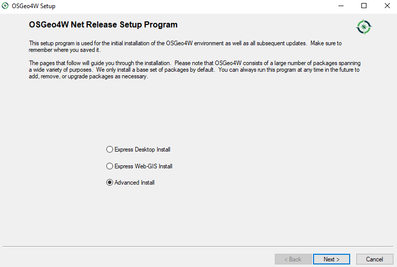
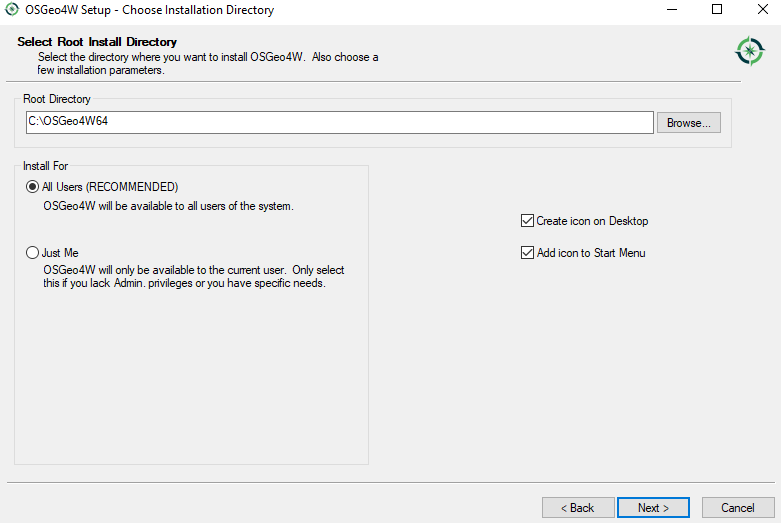
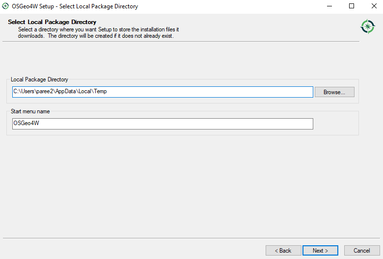
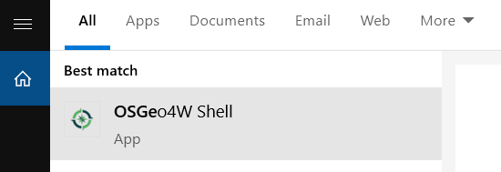

 OSGeo-installation
********************

Installation in Windows
==============================

Installing dependencies
+++++++++++++++++++++++

Following steps explain the installation procedure:
**Step1 - Download the OSGeo4W installer**

Get the OSGeo4W installer from this `link <https://download.osgeo.org/osgeo4w/osgeo4w-setup-x86_64-v1.exe>`_ .

**Step2 - Install the dependencies**

Double click the OSGeo4W installer 

* Select "advanced install" and click "Next"

* In this step there are two options, choose option 1 OR 2. Most cases option 1, unless you get a package of source libraries during a training.

   1. Select "Install from internet" and click "Next", you must be connected to a good internet.

    .. figure:: img/osgeo2a.png
       :align: center
       :width: 400

   2. Select "Install from Local Directory" and click "Next", if you want to install from the source libraries provided to you in USB.

    .. figure:: img/osgeo2b.png
       :align: center
       :width: 400

* In this step select the root directory and access to users, keep default settings, and optionally "Create icon on Desktop" for easy access.

* Here choose the folder with local repository (provided to you in USB) if you have selected option 1 in the previous step **or** choose the folder (default option) to download the libraries from internet if you have selected option 2 in the previous step and click "Next".

* In case of option 2 "Install from internet" in the previous step, select the default option "Direct Connection" and click "Next".

* In case of option 2 "Install from internet" in the previous step, select the default option "http://download.osgeo.org" as the download site and click "Next".

* In this step, search for the following packages **one by one**, and select the appropriate (latest) versions by clicking the |icon| icon under the column **New**. Check under the **Package** column if you are selecting exact library as stated below.

.. warning::

   Do not click next before selecting all the packages listed below !

The required libraries are:

 * qgis-ltr
 * grass (select version 7.8.5-1)
 * qgis-ltr-grass-plugin7
 * msys
 * pyproj (select python3-pyproj)
 * pandas (select both python3-pandas and python3-geopandas packages)
 * scipy (select python3-scipy)
 * tcltk (select python3-tcltk)
 * pip (select python3-pip)
 * setuptools (select python3-setuptools)
 * netCDF4 (select python3-netcdf4)

Click "Next" and finish the installation

Setting environment variables
+++++++++++++++++++++++++++++

**Steps**

* Right click "This PC" in Windows 10 **OR** "My Computer" in windows 7, go to *Properties* -> *Advaced system settings* -> *Advanced* tab -> *Environment variables* -> *System variables*.
* Click new and add new system variables. Add the **Variable name** and **Variable value** as shown below. 

 * **GDAL_DATA** set to ``C:\OSGeo4W64\share\epsg_csv``

* Edit the variable **Path** in the **System variables** to add the path ``C:\OSGeo4W64\bin`` to the end followed by a semicolon (;) in windows 7 **OR** add this path as a new line in the path variable in Windows 10.

**Step3 - Install additional dependencies**

* In the program menu search for "OSGeo4W Shell" or if you have selected "Create icon on Desktop" option in the previous step, it should be in the desktop. Now open "OSGeo4W Shell"

* In the OSGeo4W Shell type in the following commands to install packages - *openpyxl, joblib*

.. code-block:: bash
   :linenos:

   # Install following packages
   # First enable python 3 by typing the following command and 'enter'
   py3_env
   pip3 install openpyxl joblib
   pip3 install grass_session

.. warning::

   In case the above installation give ``fatal error`` then please try the following commands.

.. code-block:: bash
   :linenos:

   python -m pip3 install openpyxl joblib
   python -m pip3 install grass_session

Installation in Linux
============================

The below steps are tested in Ubuntu 18.04 LTS, it should also work in other Linux distibutions, you may have to adapt some of the installation steps accordingly. This is also valid for installation in **Bash for Windows** app with Ubuntu inside windows 10.

.. note::

   You can check the python version using the command ``python --version`` in a terminal

Installing dependencies
+++++++++++++++++++++++
The dependencies packages are same as those in windows except for msys. We also install git to download and clone the PySEBAL_dev repository.

Open a Terminal and type in following commands to install required packages. You should have admin rights to install packages.

.. warning::

   Please remove all the QGIS and GRASS packages you may have installed from other repositories before doing the update.

.. code-block:: Shell
   :linenos:

   # After each command click enter
   # Any line starting with '#' is comment line
   # Install git
   sudo apt-get install git
   # Add a PPA to install required GIS softwares
   sudo add-apt-repository ppa:ubuntugis/ubuntugis-unstable
   sudo apt-get update
   # Install qgis and qgis-grass plugin
   sudo apt-get install qgis qgis-plugin-grass
   # Install GRASS GIS and required packages
   sudo add-apt-repository ppa:ubuntugis/ppa
   sudo add-apt-repository ppa:grass/grass-stable
   sudo apt-get update
   sudo apt-get install grass78
   # Install openpyxl, netCDF4, joblib packages
   # For python 3, use pip3 to install ....
   pip install openpyxl netCDF4 joblib

For other Linux distributions there is detailed instruction to install qgis `here <https://qgis.org/en/site/forusers/alldownloads.html>`_ and grass gis `here <https://grass.osgeo.org/download/software/linux/>`_.

.. note::

   Now go to the folder ``D:\PySEBAL_dev\test_data\output\Output_evapotranspiration`` and check the daily ETa map (*L8_ETact_24_30m_2014_03_10_069.tif*) in QGIS.
